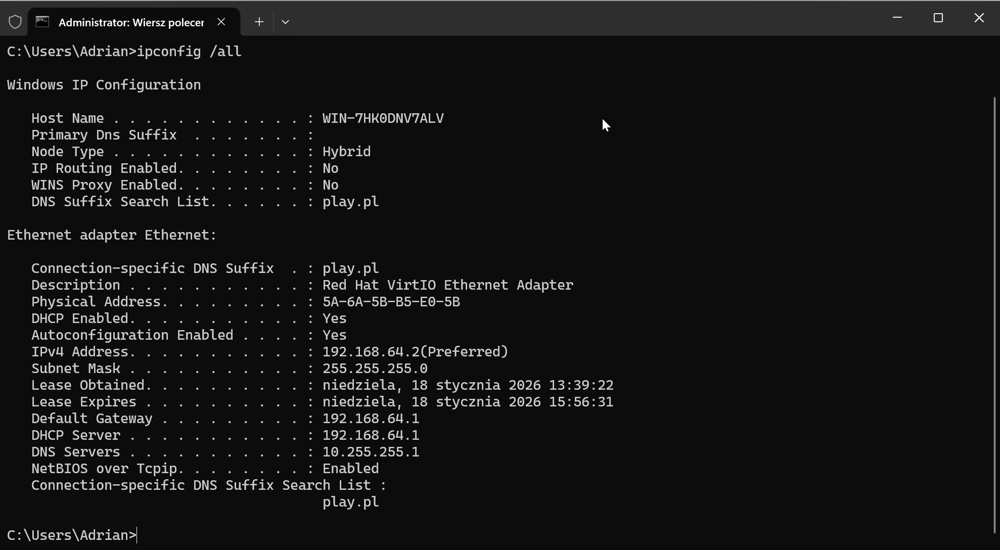
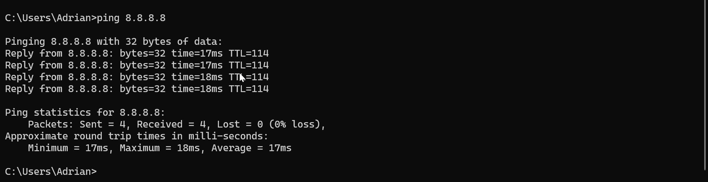
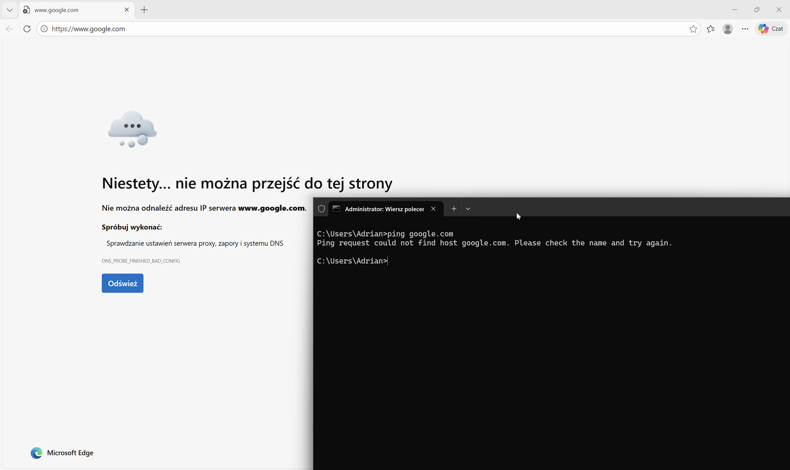
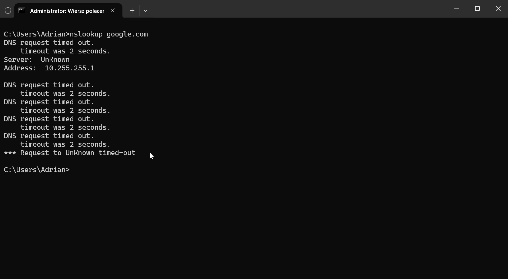
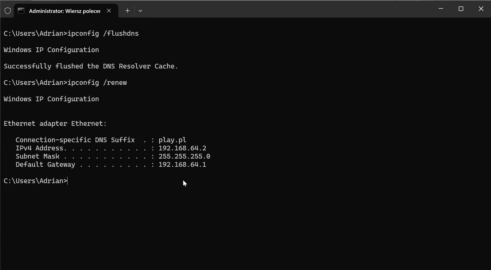
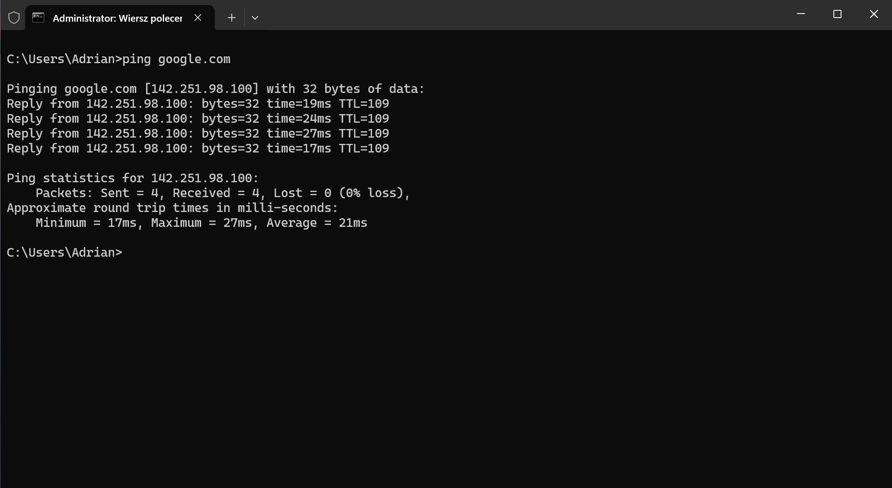

# Projekt 1: Network Detective – Diagnostyka sieci

### Opis Projektu
Symulacja zgłoszenia Help Desk dotyczącego braku dostępu do Internetu.
**Scenariusz:** Użytkownik zgłasza, że nie może otwierać stron internetowych, mimo że jest podłączony do sieci. Komunikatory i inne usługi również nie działają. Moim zadaniem było zdiagnozowanie problemu w warstwie sieciowej modelu OSI, wykrycie przyczyny awarii i przywrócenie dostępu.

### Użyte Narzędzia
* **Wiersz poleceń (CMD):** Główne narzędzie diagnostyczne.
* **Komendy:** `ping`, `tracert`, `nslookup`, `ipconfig`.
* **System:** Windows 11 Pro (Środowisko testowe).

---

### Proces Rozwiązywania Problemu (Troubleshooting)

#### Krok 1: Weryfikacja konfiguracji IP
Rozpocząłem od sprawdzenia obecnej konfiguracji interfejsów sieciowych, aby wykluczyć problem z serwerem DHCP lub brakiem adresu (tzw. adres APIPA 169.254.x.x).

`Komenda: ipconfig /all`

**Analiza:** Komputer posiada poprawny adres IP z puli lokalnej. Moją uwagę zwrócił jednak ręcznie ustawiony, nietypowy adres serwera DNS, który nie należy do standardowej infrastruktury sieciowej.

#### Krok 2: Test łączności fizycznej (Ping po IP)
Aby sprawdzić, czy problem leży w samym łączu internetowym, czy w usłudze rozwiązywania nazw, wykonałem test ping na publiczny adres IP Google (8.8.8.8).

`Komenda: ping 8.8.8.8`

**Wniosek:** Pakiety są przesyłane i wracają poprawnie (Reply). Oznacza to, że karta sieciowa, kabel/Wi-Fi oraz routing (Brama domyślna) działają poprawnie.

#### Krok 3: Weryfikacja rozwiązywania nazw (DNS)
Tu nastąpił kluczowy moment diagnozy. Najpierw spróbowałem wywołać hosta po nazwie, aby potwierdzić problem zgłaszany przez użytkownika.

`Komenda: ping google.com`

**Obserwacja:** Otrzymałem błąd *Ping request could not find host*. Potwierdza to, że komputer nie potrafi przetłumaczyć nazwy na adres IP.

#### Krok 4: Potwierdzenie źródła problemu
Aby mieć 100% pewności, że winny jest serwer DNS, użyłem narzędzia dedykowanego do zapytań DNS.

`Komenda: nslookup google.com`

**Diagnoza:** "Request timed out". Skonfigurowany serwer DNS nie odpowiada. Jest to bezpośrednia przyczyna awarii ("Root Cause").

#### Krok 5: Rozwiązanie problemu (Fix)
Zmieniłem konfigurację karty sieciowej na automatyczne pobieranie adresu DNS z serwera DHCP (w ustawieniach karty sieciowej). Następnie w konsoli wyczyściłem pamięć podręczną DNS (flush), aby usunąć ewentualne błędne wpisy, i odnowiłem dzierżawę adresu.

`Komenda: ipconfig /flushdns, ipconfig /renew`

#### Krok 6: Weryfikajca końcowa(Fix)

Po naprawie wykonałem ponowny test. Strony otwierają się poprawnie, a system prawidłowo rozwiązuje nazwę google.com na adres IP.

Komenda: ping google.com

*Autor: Adrian Tabasz*

