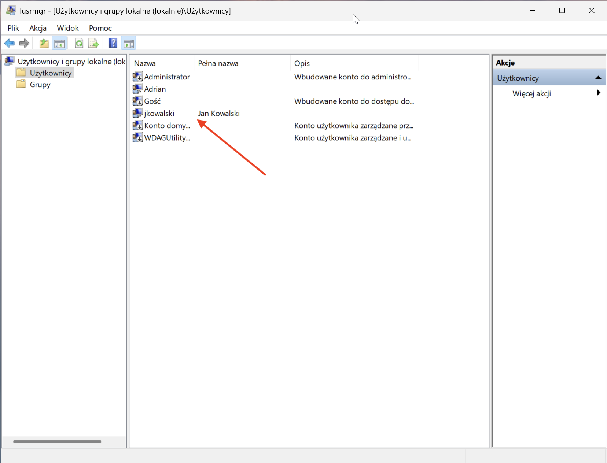
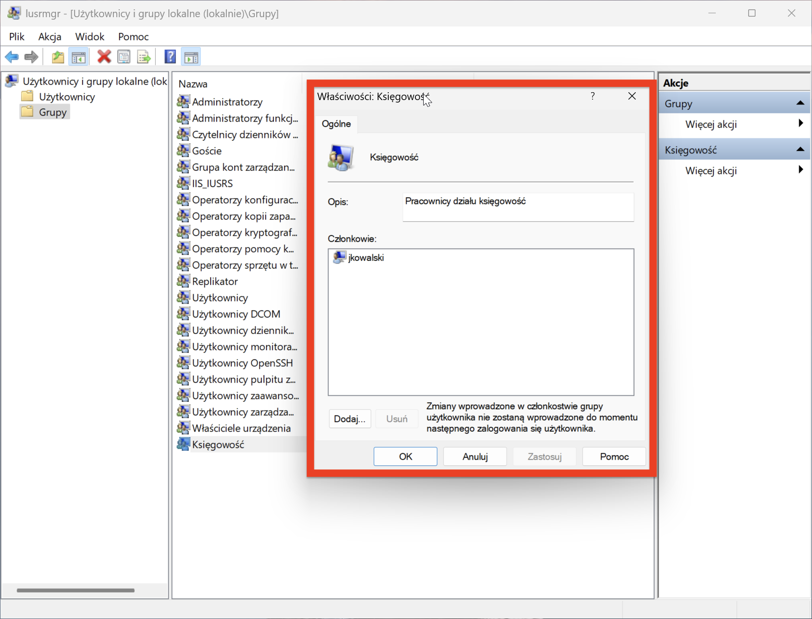
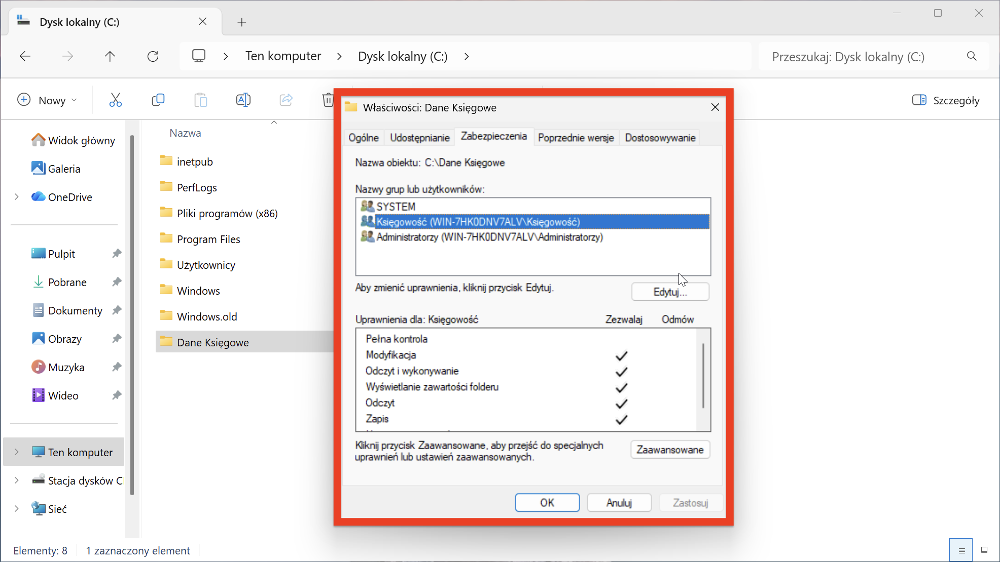
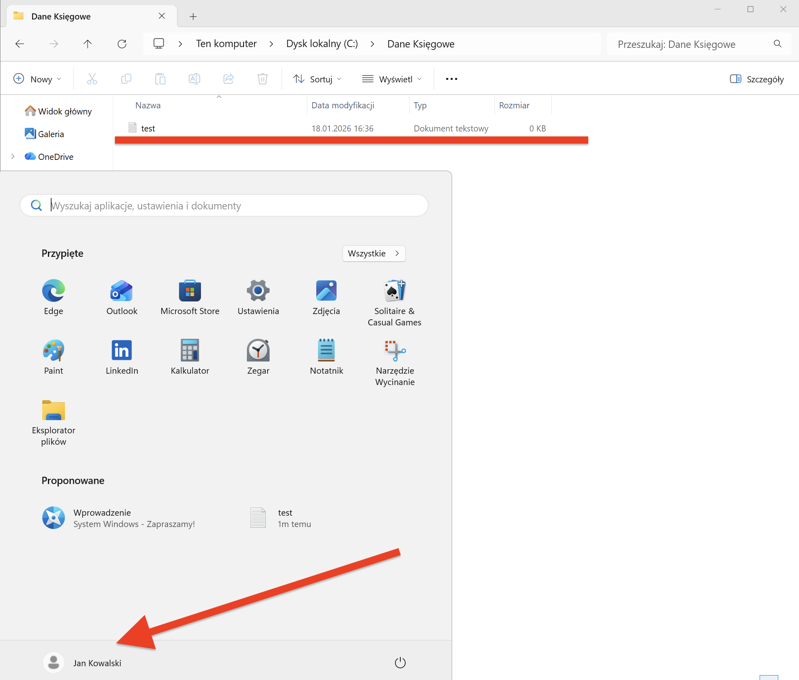

# Projekt 2: Local Admin – Zarządzanie Tożsamością i Dostępem

### Opis Projektu
Symulacja zadania typu "Onboarding" – przygotowanie środowiska pracy dla nowego pracownika.
**Scenariusz:** Do firmy dołącza **Jan Kowalski**, który zasili dział Księgowości. Moim zadaniem było utworzenie dla niego bezpiecznego konta, przypisanie go do odpowiedniej grupy oraz wydzielenie zasobu dyskowego, do którego dostęp będą mieli **wyłącznie** pracownicy księgowości (zgodnie z zasadą poufności danych).

### Użyte Narzędzia
* **MMC Snap-in:** `lusrmgr.msc` (Lokalni użytkownicy i grupy).
* **Eksplorator plików:** Konfiguracja uprawnień NTFS (ACL).
* **System:** Windows 11 Pro.

---

### Realizacja Zadania (Step-by-Step)

#### Krok 1: Utworzenie konta użytkownika
Rozpocząłem od stworzenia konta w systemie lokalnym. Zgodnie z dobrymi praktykami bezpieczeństwa, wymusiłem zmianę hasła przy pierwszym logowaniu, aby tylko użytkownik znał swoje hasło docelowe.

* **Login:** `jkowalski`
* **Polityka haseł:** "Użytkownik musi zmienić hasło przy następnym logowaniu"

#### Krok 2: Konfiguracja Grup (RBAC)
Zamiast nadawać uprawnienia bezpośrednio użytkownikowi (co jest błędem w zarządzaniu), zastosowałem model **RBAC (Role-Based Access Control)**. Stworzyłem grupę funkcjonalną `Księgowość` i dodałem do niej Jana Kowalskiego.

#### Krok 3: Zabezpieczanie danych (NTFS Permissions)
Stworzyłem folder `Dane Księgowe`. Domyślnie system Windows dziedziczy uprawnienia, dając dostęp grupie "Użytkownicy" (wszyscy). Aby zapewnić poufność:
1. Wyłączyłem dziedziczenie uprawnień.
2. **Usunąłem** grupę "Użytkownicy".
3. Dodałem grupę `Księgowość` z uprawnieniami "Modyfikacja".

Dzięki temu inni pracownicy logujący się na ten komputer nie będą mieli wglądu do tych plików.

#### Krok 4: Weryfikacja dostępu
Przełączyłem użytkownika na `jkowalski`. System poprosił o zmianę hasła (zgodnie z konfiguracją). Po zalogowaniu zweryfikowałem, że użytkownik ma dostęp do folderu i może tworzyć w nim pliki.

*Autor: Adrian Tabasz*
