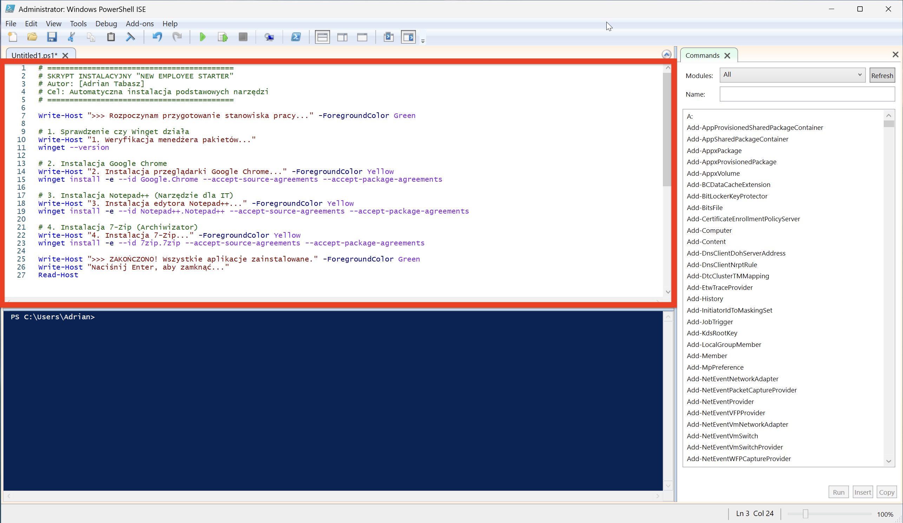
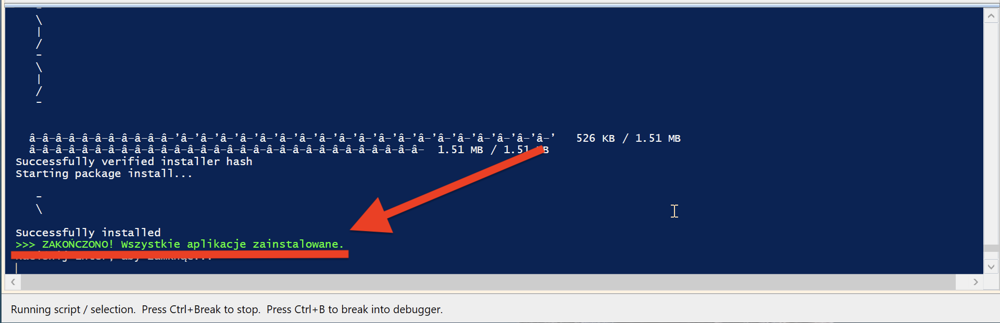
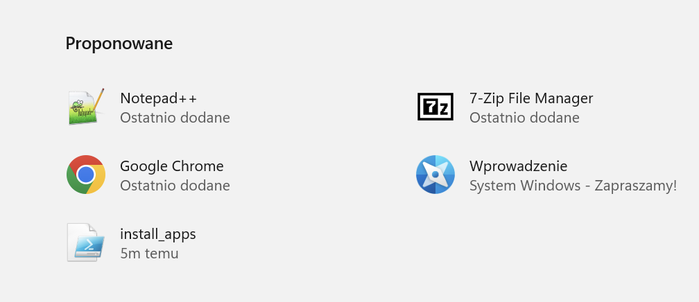

# Projekt 3: Automator – Skrypt wdrażający oprogramowanie

### Opis Projektu
Symulacja zadania typu "Mass Deployment" – przygotowanie wielu stacji roboczych dla nowych pracowników.
**Scenariusz:** Dział IT otrzymał zadanie przygotowania 10 nowych laptopów. Ręczna instalacja podstawowych aplikacji (Chrome, Notepad++, 7-Zip) zajęłaby około 20 minut na każdy komputer (łącznie ponad 3 godziny).
**Cel:** Napisanie skryptu w PowerShell, który wykona to zadanie automatycznie w tle, redukując czas pracy administratora do jednego kliknięcia.

### Użyte Narzędzia
* **Język:** PowerShell 5.1 / 7
* **Pakiet:** Winget (Windows Package Manager)
* **Środowisko:** Windows 11 Pro

### Pliki w repozytorium
* [**install_apps.ps1**](./install_apps.ps1) - Główny kod skryptu automatyzującego.

---

### Proces Realizacji (Step-by-Step)

#### Krok 1: Pisanie skryptu (PowerShell ISE)
Wykorzystałem natywne narzędzie `winget` (Windows Package Manager), aby pobrać najnowsze wersje oprogramowania bezpośrednio z bezpiecznych repozytoriów. Użyłem flag `-e` (exact match) oraz `--accept-package-agreements`, aby instalacja odbywała się bezobsługowo (silent install).

#### Krok 2: Konfiguracja polityki bezpieczeństwa
Domyślnie system Windows blokuje wykonywanie niepodpisanych skryptów. Aby uruchomić moją automatyzację, zmieniłem politykę wykonywania (Execution Policy) na poziomie sesji/lokalnym.

`Komenda: Set-ExecutionPolicy RemoteSigned`

#### Krok 3: Wykonanie Automatyzacji
Po uruchomieniu skryptu, system automatycznie połączył się z repozytoriami, pobrał instalatory i zainstalował je w tle. Administrator w tym czasie może zajmować się innymi zadaniami.

#### Krok 4: Weryfikacja
Po zakończeniu działania skryptu (czas trwania: ok. 2 minuty), zweryfikowałem obecność aplikacji w systemie. Wszystkie programy są gotowe do użycia.

*Autor: Adrian Tabasz*
