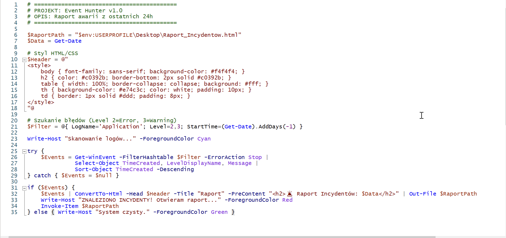
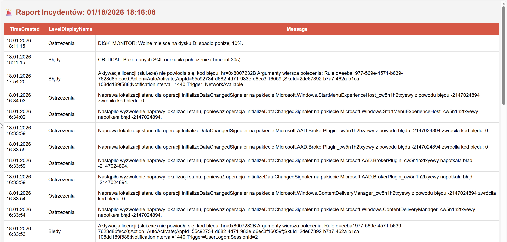

# Projekt 4: Event Hunter – Automatyczny Audyt Logów

### Opis Projektu (Business Case)
**Problem:** W środowisku firmowym administrator musi codziennie weryfikować stan serwerów. Ręczne przeglądanie "Podglądu zdarzeń" (Event Viewer) na kilkunastu maszynach jest nieefektywne i podatne na błędy ludzkie (przeoczenie incydentu).
**Rozwiązanie:** Stworzyłem narzędzie **"Event Hunter"** – skrypt w PowerShell, który automatycznie skanuje dzienniki systemowe, filtruje kluczowe zdarzenia (Błędy i Ostrzeżenia z ostatnich 24h) i generuje czytelny raport HTML dla zespołu IT.

### Użyte Technologie
* **Język:** PowerShell 5.1 / 7
* **Metoda filtracji:** `FilterHashtable` (dla maksymalnej wydajności przy dużych logach)
* **Raportowanie:** HTML5 + CSS (generowane dynamicznie)
* **Źródło danych:** Windows Event Log (System & Application)

### Pliki w repozytorium
* [**EventHunter.ps1**](./EventHunter.ps1) - Główny kod narzędzia audytowego.

---

### Proces Realizacji (Step-by-Step)

#### Krok 1: Logika Skryptu i Optymalizacja
Zamiast używać wolnego polecenia `Where-Object`, zastosowałem **Hash Tables** do filtrowania zdarzeń już na poziomie silnika systemowego. Dzięki temu skrypt działa błyskawicznie nawet przy tysiącach wpisów. Zaimplementowałem również obsługę błędów (`Try/Catch`), aby skrypt nie przerywał działania w przypadku pustych logów.

#### Krok 2: Generowanie Danych Testowych (Seed Data)
Aby zweryfikować skuteczność narzędzia, najpierw przeprowadziłem symulację awarii, wstrzykując do systemu fałszywe zdarzenia krytyczne (Event ID 1000 - Błąd Bazy Danych) oraz ostrzeżenia (Event ID 2000 - Kończące się miejsce na dysku).

#### Krok 3: Raportowanie i Wizualizacja
Surowe dane z konsoli są mało czytelne dla managementu. Dlatego skrypt automatycznie konwertuje obiekty PowerShell na sformatowaną tabelę HTML z użyciem stylów CSS (kolorowanie nagłówków, czytelny font). Raport otwiera się automatycznie po zakończeniu skanowania.

*Autor: Adrian Tabasz*
