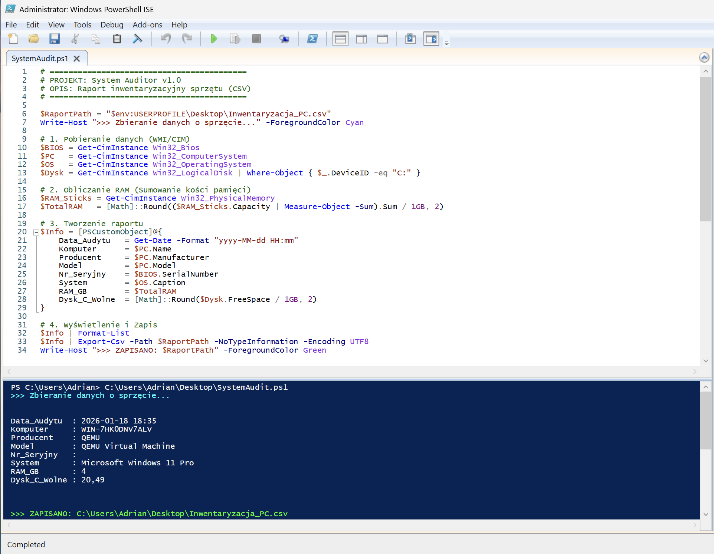
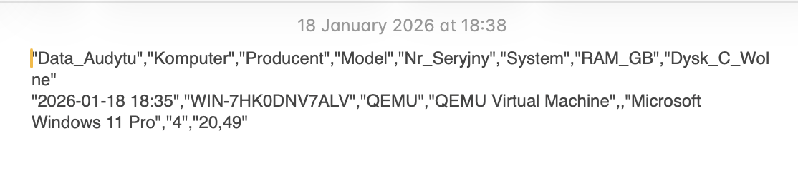

# Projekt 5: System Auditor – Inwentaryzacja Sprzętu

### Opis Projektu (Business Case)
**Problem:** Firma potrzebuje raportu inwentaryzacyjnego przed planowaną modernizacją sprzętu. Ręczne spisywanie parametrów (RAM, Dysk, S/N) z każdego komputera jest czasochłonne i podatne na pomyłki.
**Rozwiązanie:** Stworzyłem skrypt w PowerShell, który wykorzystuje WMI/CIM do automatycznego pobrania detali technicznych stacji roboczej i eksportuje je do uniwersalnego formatu CSV (Excel).

### Użyte Technologie
* **Język:** PowerShell 5.1 / 7
* **Protokół:** WMI / CIM (Windows Management Instrumentation)
* **Struktury danych:** PSCustomObject
* **Format danych:** CSV (Comma Separated Values)

### Pliki
* [**SystemAudit.ps1**](./SystemAudit.ps1) - Kod skryptu inwentaryzacyjnego.

---

### Działanie Skryptu

#### Krok 1: Pobieranie danych (WMI)
Skrypt odpytuje system o kluczowe komponenty. Zamiast prostych komend, użyłem klas WMI (np. `Win32_Bios`, `Win32_PhysicalMemory`), co pozwala wyciągnąć numer seryjny, dokładny model kości RAM i stan dysków.

#### Krok 2: Przetwarzanie i Raportowanie
Surowe dane (w bajtach) są przeliczane na gigabajty (GB) i zaokrąglane dla czytelności. Następnie tworzony jest niestandardowy obiekt (`PSCustomObject`), który łączy dane z różnych źródeł w jedną spójną tabelę.

#### Krok 3: Eksport do CSV
Wynik końcowy jest zapisywany w pliku `.csv`, który może być natychmiast otwarty przez dział księgowości lub IT w programie Excel.

*Autor: Adrian Tabasz*
