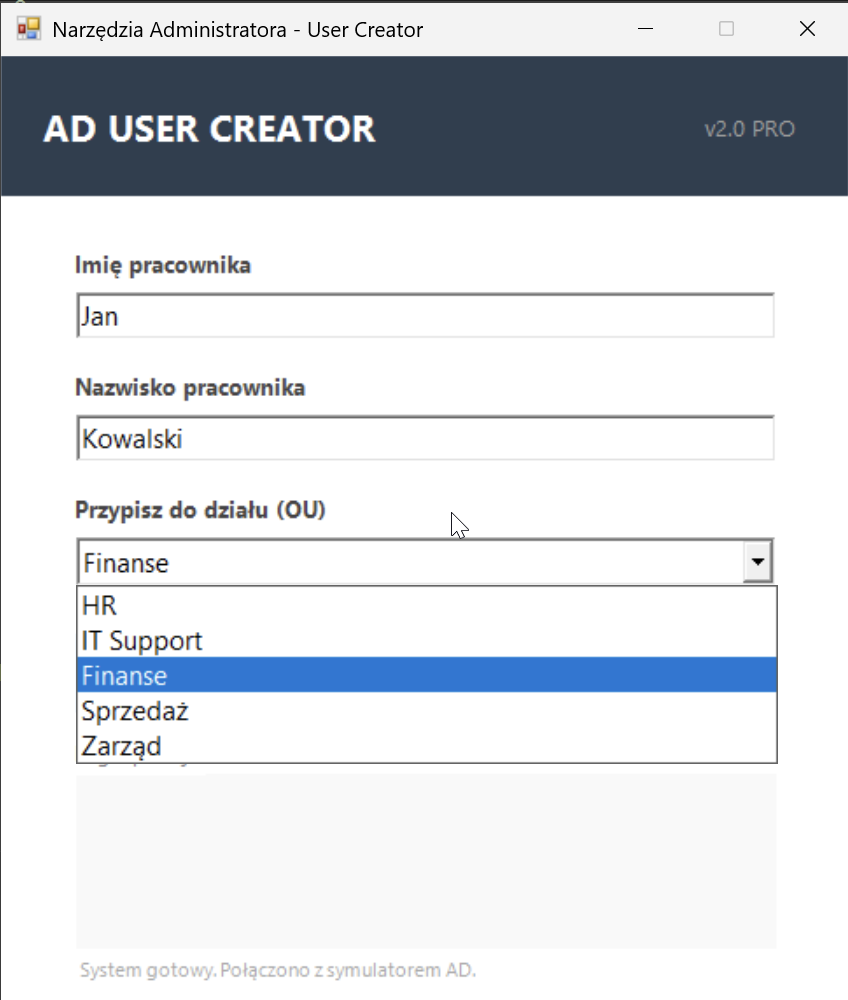
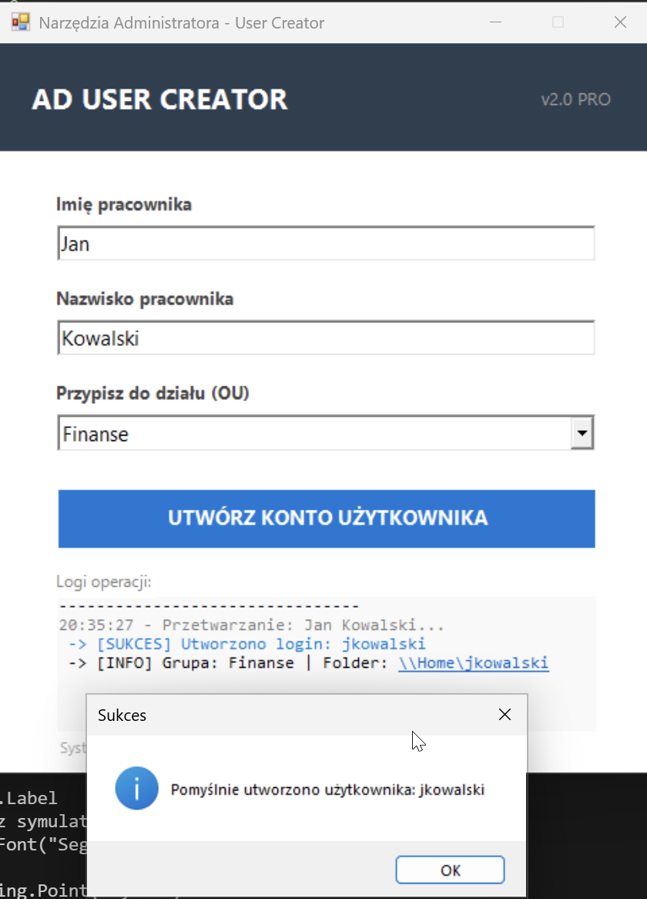

# PowerShell Active Directory User Creator

> **Profesjonalne narzędzie GUI do automatyzacji onboardingu pracowników w środowisku Active Directory.**

---

## Opis Problemu i Rozwiązanie (Case Study)

**Problem:**
W pracy IT Helpdesk ręczne zakładanie kont użytkowników jest procesem powtarzalnym i podatnym na błędy (np. literówki w nazwisku, pomyłka w wyborze działu, zapomnienie o folderze domowym). Zajmuje to cenny czas, który można poświęcić na trudniejsze zgłoszenia.

**Moje Rozwiązanie:**
Stworzyłem aplikację z graficznym interfejsem (Windows Forms), która:
1.  **Standaryzuje dane:** Wymusza wybór działu z listy i sprawdza, czy pola nie są puste.
2.  **Automatyzuje logikę:** Generuje login (pierwsza litera imienia + nazwisko) i hasło startowe.
3.  **Działa bezpiecznie:** Posiada tryb symulacji (`Mock Mode`), dzięki czemu można testować narzędzie bez ingerencji w serwer produkcyjny.

### Galeria (Jak to wygląda)

**1. Nowoczesny Interfejs Graficzny**
Przejrzysty formularz z walidacją danych (nie pozwala wysłać pustych pól).

**2. Potwierdzenie sukcesu i Logi**
Po utworzeniu użytkownika, system generuje logi operacji w czasie rzeczywistym oraz wyświetla komunikat sukcesu.

**3. Czysty i zorganizowany kod**
Logika oddzielona od warstwy wizualnej, obsługa błędów `Try/Catch`.

---

### Główne funkcjonalności
* **GUI (Windows Forms):** Intuicyjny interfejs zamiast konsoli tekstowej.
* **Automatyzacja:** Generowanie unikalnego loginu (Imię + Nazwisko) i hasła startowego.
* **Bezpieczeństwo:** Walidacja wprowadzanych danych przed wysłaniem do AD.
* **Logowanie:** Konsola wyświetlająca postęp prac (np. przypisanie do grupy, utworzenie folderu domowego).
* **Tryb Symulacji:** Możliwość prezentacji działania programu na dowolnym komputerze bez Windows Server.

### Technologie
* **Język:** PowerShell 5.1 / Core
* **Framework GUI:** .NET Windows Forms
* **Moduły:** Active Directory Module

### Jak uruchomić?
1. Pobierz plik `AD_User_Creator.ps1`.
2. Uruchom go w środowisku PowerShell ISE lub Visual Studio Code.
3. Wypełnij formularz i kliknij "Utwórz konto".

---
*Autor: Adrian Tabasz*
