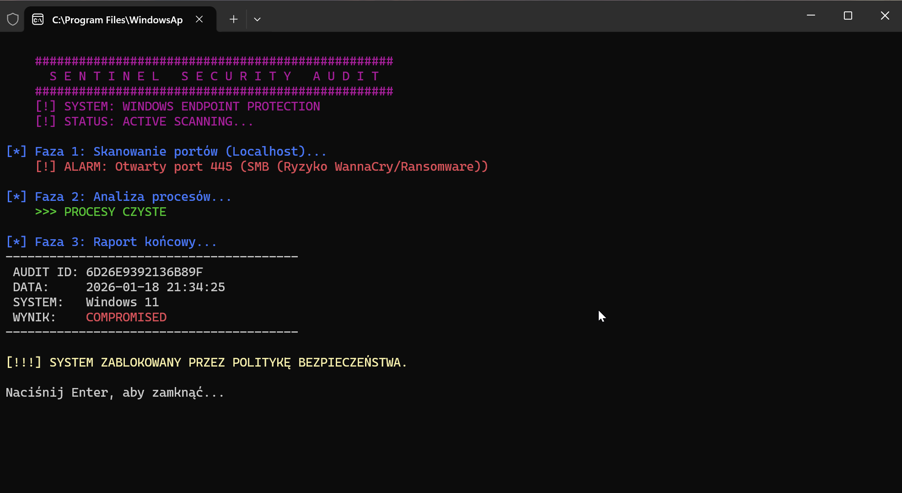
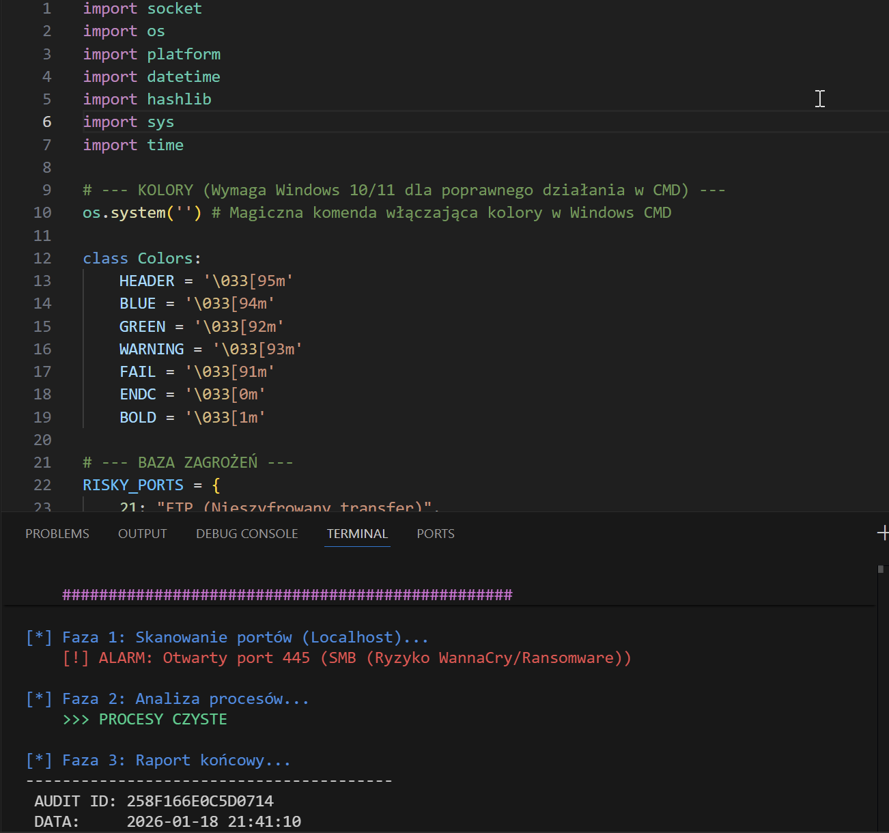

# Sentinel - Endpoint Security Auditor

> **Zautomatyzowany skaner bezpieczeństwa dla działów IT Helpdesk do wstępnego audytu stacji roboczych przed podłączeniem do domeny.**

---

## Scenariusz Użycia (Use Case)
W codziennej pracy IT Helpdesk często musimy zweryfikować bezpieczeństwo komputera (np. powracającego z serwisu lub prywatnego laptopa BYOD), zanim podłączymy go do sieci firmowej. Ręczne sprawdzanie portów i procesów jest czasochłonne.

**Rozwiązanie:**
Stworzyłem skrypt `Sentinel`, który w 5 sekund wykonuje "Sanity Check" urządzenia. Jeśli wykryje krytyczne luki (np. otwarty port SMB podatny na Ransomware), automatycznie blokuje urządzenie (status `COMPROMISED`).

---

## Galeria i Działanie

### 1. Wykrycie luki bezpieczeństwa (Windows 11)
Poniżej przykład realnego audytu. Narzędzie wykryło otwarty port **445 (SMB)** na stacji roboczej, co stanowi poważne ryzyko ataku typu Ransomware/WannaCry. System otrzymał status `COMPROMISED`.

### 2. Przejrzysty Kod (Python)
Skrypt wykorzystuje bibliotekę `socket` do skanowania sieci oraz moduł `hashlib` do generowania unikalnego identyfikatora audytu (zapobiega to fałszowaniu wyników).

---

## Funkcjonalności Techniczne

* **Port Scanner:** Sprawdza lokalnie (`127.0.0.1`), czy otwarte są ryzykowne usługi. Wykrywa m.in.:
    * `FTP (21)` - Nieszyfrowany transfer plików.
    * `SMB (445)` - Główny wektor ataków w sieciach Windows.
    * `RDP (3389)` - Nieautoryzowany dostęp zdalny.
* **Analiza Procesów:** Weryfikuje, czy w tle nie działają procesy o nazwach wskazujących na malware (np. `miner`, `keygen`, `mimikatz`).
* **Integralność Danych:** Generuje sumę kontrolną (Audit ID) dla każdego raportu.
* **Kompatybilność:** Działa na Windows 10/11 (CMD/PowerShell) oraz systemach Unix (macOS/Linux).

---

## Jak uruchomić?

Wymagany jest zainstalowany interpreter Python.
